# PROSES / LANGKAH - LANGKAH PRAKTIKUM 5

## Latihan 5

###  BUATLAH SEBUAH LIST SEBANYAK 5 ELEMENT DENGAN NILAI BEBAS

- AKSES LIST

 - Tampilkan element ke 3 
 - Ambil nilai element ke 2 sampai ke 4
 - Ambil element terakhir 
  
  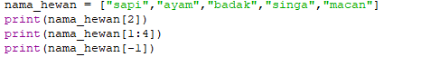
  
  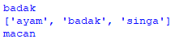

###  UBAH ELEMENT LIST

  - Ubah element ke 4 dengan nilai lainya 
  - Ubah element ke 4 dengan element terakhir
  
    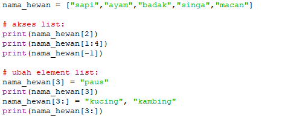
    
    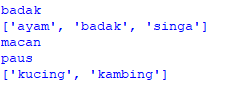
    
###  TAMBAH ELEMENT LIST
    
  - Ambil 2 bagian dari list pertama (A) dan         jadikan list kedua (B)
  - Tambah list B dengan string
  - Tambah list B dengan 3 nilai
  - Gabungan list A dengan List B

    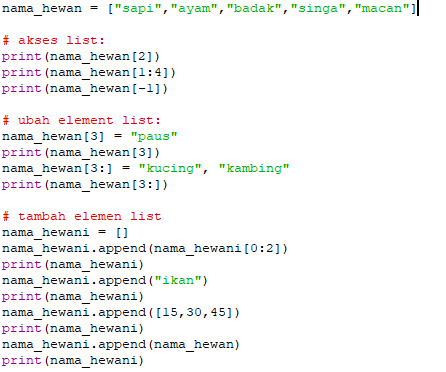
    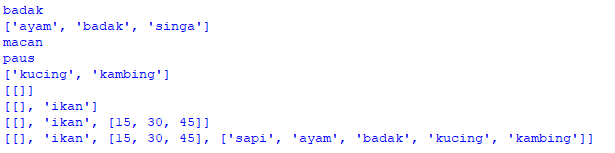

## TUGAS PRAKTIKUM 5

## BUATLAH PROGRAM SEDERHANA UNTUK MENAMBAH KAN DATA KE DALAM SEBUAH LIST DENGAN RINCIAN 

  - Program meminta memasukan data sebanyak banyak nya(Menggunakan perulangan)
  - Tampilkan sebuah pilihan untuk menambah data ^(Y/T)?*,apabila jawaban T(Tidak),maka program akan menampilkan daftar datanya 
  - Nilai akhir di ambil dari 3 perhitungan komponen nilai (Tugas : 30%,UTS : 35%,UAS :35%)

# LANGKAH LANGKAH YANG SAYA GUNAKAN

- Pertama tama kita akan membuat codingan atau list seperti di bawah ini

 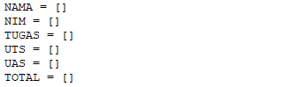

- Setelah tadi kita membuat list yang di atas kemudian kita akan membuat perulangan supaya kita dapat memasukan data sebanyak banyak nya

 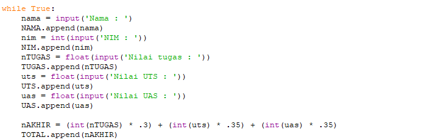

- Kemudian kita akan membuat program pilihan (Y/T)?, Yaitu ketika kita akan menginputkan Y,maka langsung pada saat itu akan muncul atau di minta untuk mengisi data kembali, Tetapi pada saat kita ingin menginputkan T, Maka program yang kita tadi jalankan akan berakhir dengan menampilkan hasil inputan yang tadi kita buat

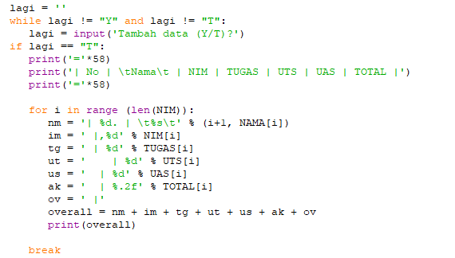

 - Hasil dari program yang kita buat tadi akan seperti ini
 
 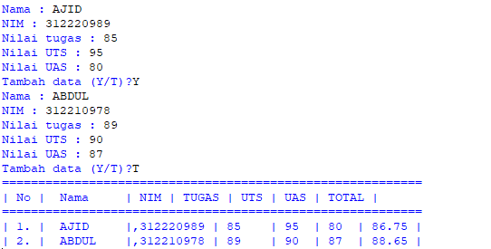
 
### FLOWCHART LATIHAN 5

 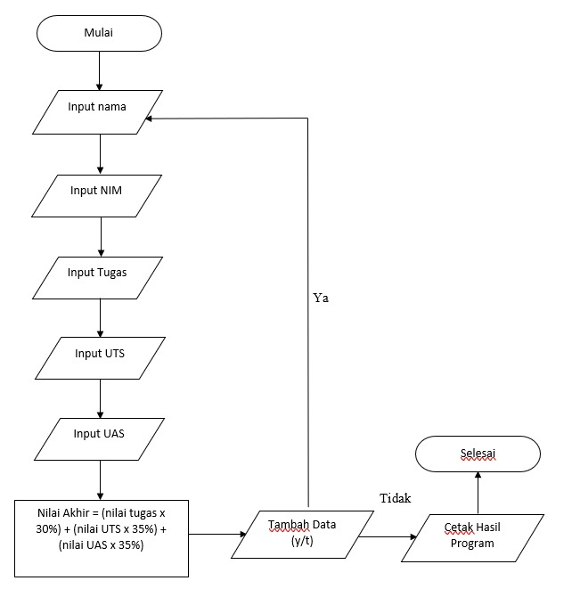
